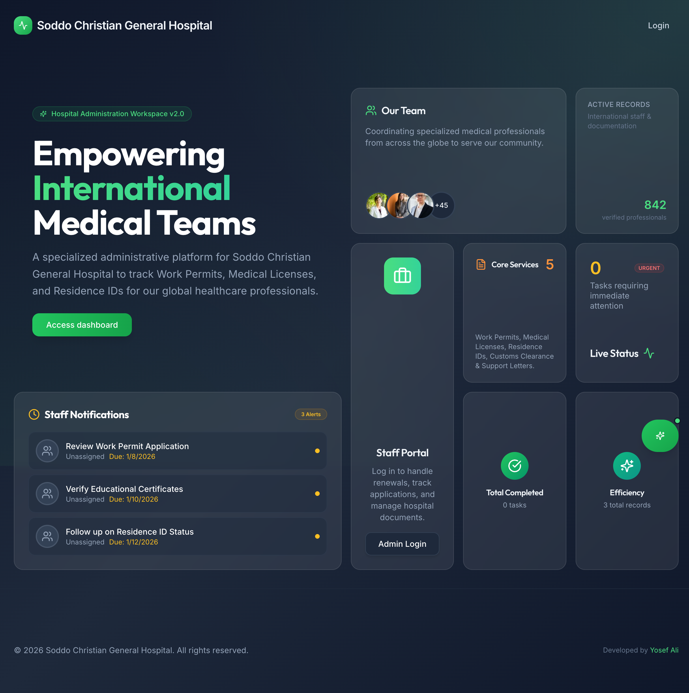
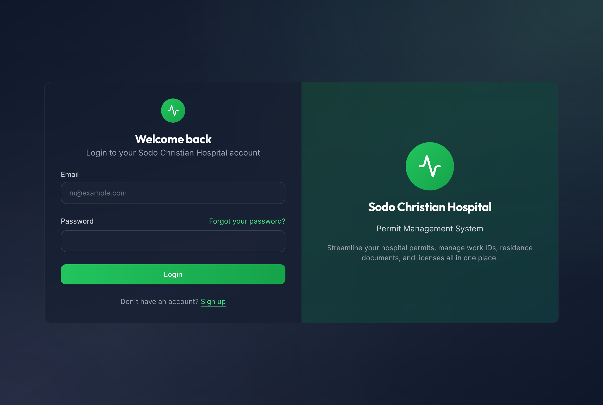

# Sodo Christian Hospital - Permit Management System

A modern, full-stack web application for managing work permits, residence IDs, and medical licenses for foreign workers at Sodo Christian Hospital, Ethiopia.



## 🌐 Live Demo

**Production:** [https://sch-addis.org](https://sch-addis.org)

## ✨ Features

- **👥 Foreigner Management** - Track foreign workers, their documents, and permit status
- **📋 Permit Tracking** - Manage Work Permits, Residence IDs, and Medical Licenses
- **📄 Document Management** - Upload, organize, and track required documents
- **🔄 Workflow Stages** - Track permit applications through each stage
- **📊 Dashboard** - Real-time statistics and overview
- **🤖 AI Assistant** - Built-in chatbot for permit inquiries
- **📱 Responsive Design** - Works on desktop and mobile
- **🔐 Role-Based Access** - Admin, HR Manager, HR Staff, and Logistics roles

## 🖼️ Screenshots

### Login Page


## 🛠️ Tech Stack

- **Frontend:** Next.js 15, React 19, TypeScript, Tailwind CSS
- **Backend:** Next.js API Routes, Server Actions
- **Database:** PostgreSQL with Drizzle ORM
- **Authentication:** NextAuth.js v5
- **File Storage:** MinIO (S3-compatible)
- **Caching:** Redis
- **Deployment:** Docker, Nginx, Let's Encrypt SSL

## 🚀 Quick Start

### Prerequisites

- Node.js 20+
- Docker & Docker Compose
- PostgreSQL (or use Docker)

### Local Development

```bash
# Clone the repository
git clone https://github.com/Yosef-Ali/v0-sodo-hospital.git
cd v0-sodo-hospital

# Install dependencies
pnpm install

# Set up environment variables
cp .env.example .env.local

# Run database migrations
pnpm db:push

# Start development server
pnpm dev
```

### Docker Deployment

```bash
# Start all services
docker compose up -d

# View logs
docker compose logs -f app
```

## 📁 Project Structure

```
├── app/                  # Next.js App Router
│   ├── api/             # API routes
│   ├── dashboard/       # Dashboard pages
│   ├── login/           # Authentication
│   └── ...
├── components/          # React components
│   ├── ui/              # UI components
│   ├── sheets/          # Side panel forms
│   └── pages/           # Page components
├── lib/                 # Utilities
│   ├── db/              # Database schema & migrations
│   ├── actions/         # Server actions
│   └── hooks/           # Custom hooks
└── docs/                # Documentation & screenshots
```

## 🔐 Default Credentials

| Email | Password | Role |
|-------|----------|------|
| admin@sodohospital.com | Admin@123 | Admin |
| hr.manager@sodohospital.com | Admin@123 | HR Manager |
| hr.staff@sodohospital.com | Admin@123 | HR Staff |
| logistics@sodohospital.com | Admin@123 | Logistics |

## 📖 Documentation

- [Deployment Guide](DEPLOYMENT.md)
- [API Documentation](docs/API.md)

## 🤝 Contributing

Contributions are welcome! Please feel free to submit a Pull Request.

## 📄 License

This project is proprietary software for Sodo Christian Hospital.

---

Built with ❤️ for Sodo Christian Hospital, Ethiopia
